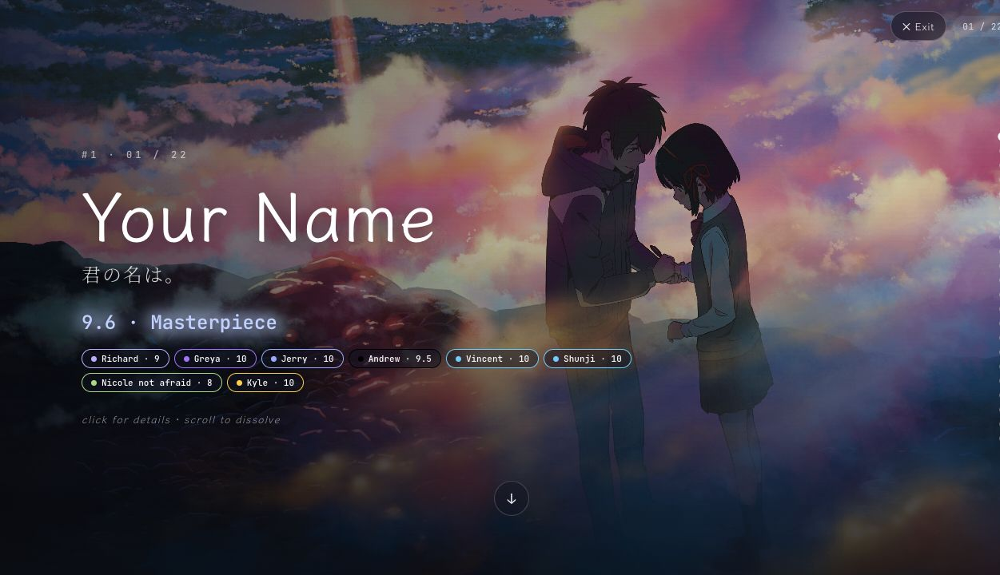
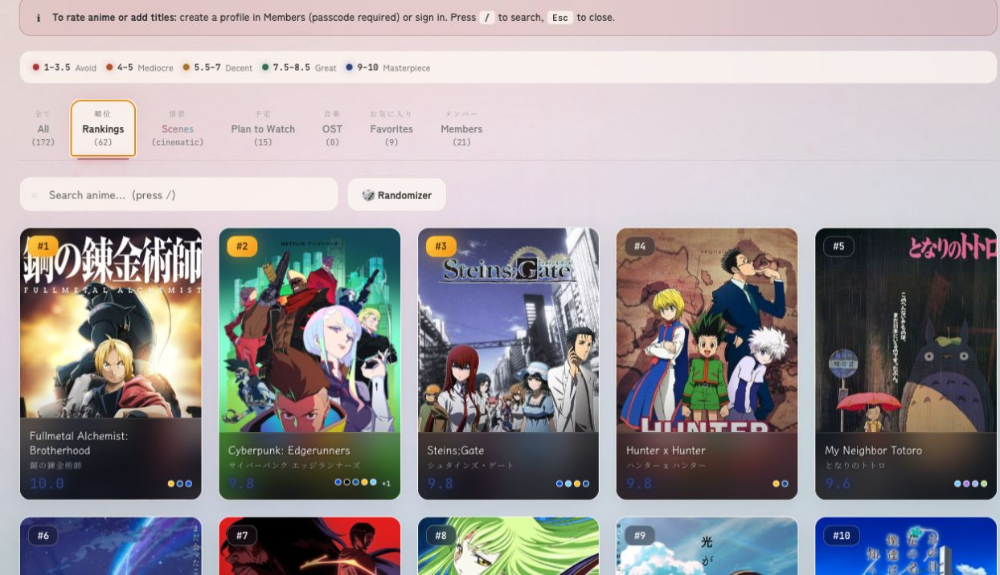
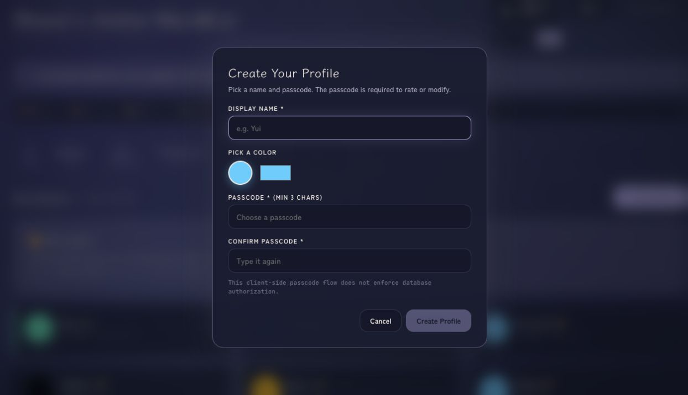
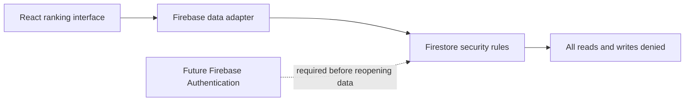

# Shunji's Anime Watch List & Rankings

A React and Firebase prototype for shared anime rankings, personal plan-to-watch lists, soundtrack entries, favorites, and a themed scene viewer.

## Interface tour

### Cinematic mode



*Cinematic mode uses a selected scene as the backdrop while keeping the shared score and individual ratings visible.*

### Rankings



*The ranked grid makes the current order easy to scan. In this capture, Fullmetal Alchemist: Brotherhood is #1, followed by Cyberpunk: Edgerunners and Steins;Gate.*

### Profile setup



1. Open the Members tab.
2. Select **Create Profile**.
3. Choose a display name, color, and passcode.

This is a legacy prototype profile flow. Its client-side passcode does not provide database authorization.

## Current state

| Interface | Data layer | Authorization | Public deployment |
|---|---|---|---|
| Working prototype | Firebase adapter retained | Rebuild required | Intentionally disabled |



The interface demonstrates the product idea and frontend implementation. Shared
persistence is deliberately contained until real user identity, ownership, and
administrator roles are implemented and tested.

> Security status: not ready for public or shared use. The checked-in Firestore rules deny all access while authentication and authorization are being rebuilt. The legacy profile passcodes are client-side checks, not trusted identities. See the [security threat model](docs/security-threat-model.md).

## Current features

- Shared anime rankings on a 1 to 10 scale with half-point increments
- Personal plan-to-watch lists
- Soundtrack entries linked to anime titles
- Curated favorites and scene configuration
- Day, sunset, and night themes
- Responsive React interface with Framer Motion animations

The data interface remains in the code for local development, but the containment rules block Firestore reads and writes. Administrator access is disabled because a secret embedded in a browser bundle cannot provide authorization.

## Technology

| Layer | Technology |
| --- | --- |
| Frontend | React 19 and Vite 8 |
| Database | Firebase Firestore |
| Hosting configuration | Firebase Hosting |
| Animation | Framer Motion |
| Styling | CSS-in-JS with themed variables |
| Authorization | Not implemented |

## Project structure

```text
src/
  main.jsx
  anime-watchlist.jsx
  firebase.js
  index.css
tests/
  firestore.rules.test.js
docs/
  security-threat-model.md
firestore.rules
firebase.json
```

## Local setup

Prerequisites:

- Node.js 18 or later
- Java for the Firestore emulator
- A Firebase project only if you are working on the later authentication milestone

Install dependencies:

```bash
npm install
```

Copy the environment template:

```bash
cp .env.example .env
```

Set the Firebase web configuration for a non-production development project. Firebase web configuration identifies a project but does not authorize database access:

```text
VITE_FIREBASE_API_KEY=your_firebase_api_key
VITE_FIREBASE_AUTH_DOMAIN=your_project.firebaseapp.com
VITE_FIREBASE_PROJECT_ID=your_project_id
VITE_FIREBASE_STORAGE_BUCKET=your_project.firebasestorage.app
VITE_FIREBASE_MESSAGING_SENDER_ID=your_sender_id
VITE_FIREBASE_APP_ID=your_app_id
VITE_FIREBASE_MEASUREMENT_ID=your_measurement_id
```

Start the development server:

```bash
npm run dev
```

## Validation

```bash
npm run test:rules
npm run lint
npm run build
```

The rules test starts a local Firestore emulator and confirms that unauthenticated and synthetic authenticated clients cannot read, write, or delete known and unknown document paths.

## Deployment warning

Do not deploy this application for public use yet. The containment rules intentionally disable shared persistence. A later milestone must add Firebase Authentication, per-user ownership, trusted administrator roles, schema validation, and tested authorization rules before Firestore access is restored.

Any administrator passkey previously placed in a `VITE_` variable must be treated as exposed because Vite includes those values in browser bundles. Remove it from the hosting environment and rotate it after containment if it was reused or still controls another system.

## License

MIT
